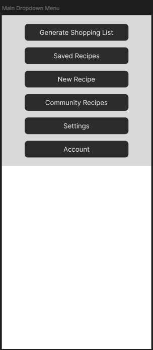
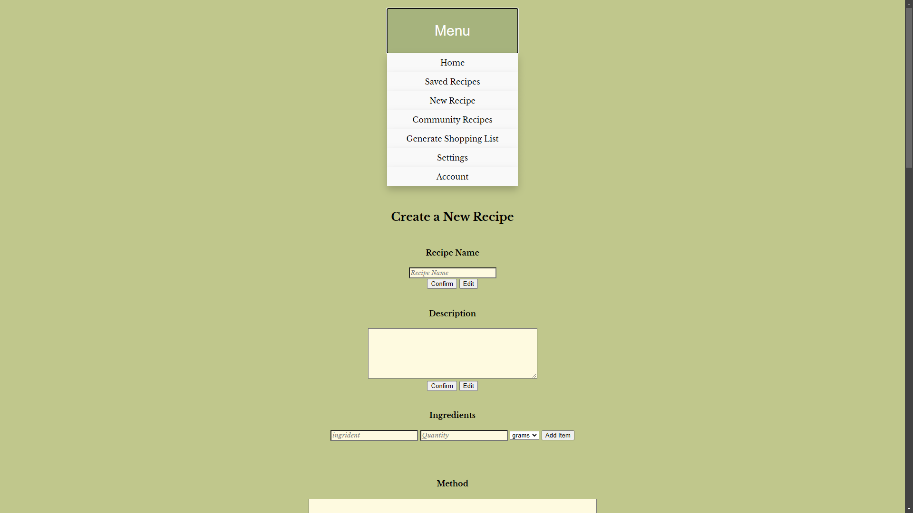
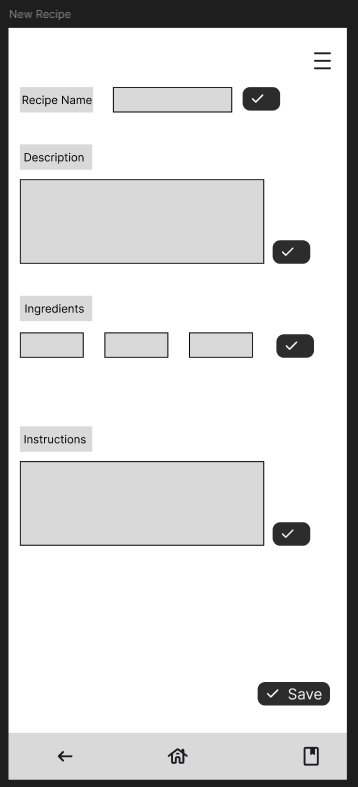

# Project overview

Trinity Planner is made with the goal of helping people add and find delicious recipes along with helping them save money and optimising their shopping. Trinity Planner will aid people that struggle to plan meals, recipes and shop for the required ingredients.

[Trinity Planner](https://chuckydillo.github.io/trinity-shopper/)

## List of features

 - Navigation Bar
	 - Navigation bar featured on each page
	 - 
	 - 
 - Landing Page
 - New Recipe
	- 
 	- 

## Future Plans
 - Community Recipes
 - Generate Shopping List
 - Setting
 - Account
 - Saved Recipe

## UX/UI

## Testing

### Validator Testing 

- HTML
  - A few errors were returned [W3C validator](https://validator.w3.org/nu/?checkerrorpages=yes&doc=https%3A%2F%2Fchuckydillo.github.io%2Ftrinity-shopper%2F)
- CSS
  - No errors were found when passing through the official [(Jigsaw) validator](https://jigsaw.w3.org/css-validator/validator?uri=https%3A%2F%2Fchuckydillo.github.io%2Ftrinity-shopper%2F&profile=css3svg&usermedium=all&warning=1&vextwarning=&lang=en)

## Deployment

- The site was deployed to GitHub pages. The steps to deploy are as follows: 
  - In the GitHub repository, navigate to the Settings tab 
  - From the source section drop-down menu, select the Master Branch
  - Once the master branch has been selected, the page will be automatically refreshed with a detailed ribbon display to indicate the successful deployment.

  The live link can be found here - https://chuckydillo.github.io/trinity-shopper/ 

## Citation of ALL sources(code, images, text)

 -  [code snippet to help with popup box](https://www.foowebs.com/p14-How-to-confirm-before-submitting-a-form-with-popup-box)
	 - ``
 -   [Grocery list tutorial video used initially to construct the foundation of the JS. The only remnants of the code left in are the functionality for the remove button.](https://www.youtube.com/watch?v=a6Y0GMmMMOI)
 - use of chatgpt to assist with JS for loading a nav bar.
	 - `// loadNavbar.js document.addEventListener('DOMContentLoaded', function() { // Get the element where the navigation bar will be injected const navContainer = document.getElementById('navbar-container'); // Check if the navContainer exists if (navContainer) { // Fetch the navigation bar HTML fetch('navbar.html') .then(response => response.text()) .then(data => { // Inject the fetched HTML into the container navContainer.innerHTML = data; }) .catch(error => console.error('Error loading the navbar:', error)); } });`

## Known Bugs
-"Ingredient" is spelt wrong in several places.
